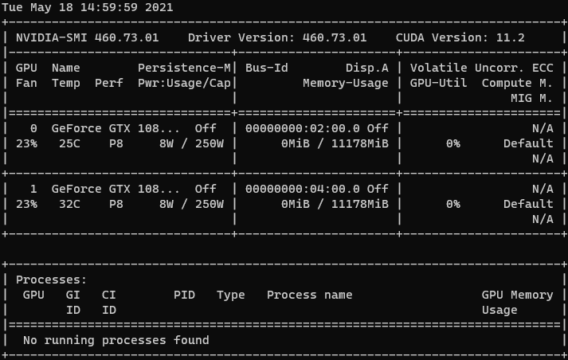
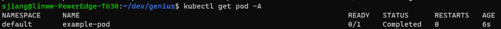
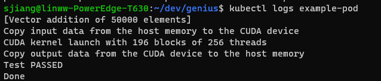
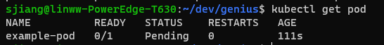
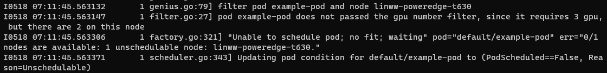

# Genius

# Introduction

Genius scheduler is a coarse-grained scheduler extension for kubernetes (k8s) cluster.

It is implemented upon [scheduler framework](https://github.com/kubernetes/enhancements/blob/master/keps/sig-scheduling/624-scheduling-framework/README.md#queue-sort) and [ObserverWard](https://github.com/jiangxiaosheng/ObserverWard), which is a monitoring tool in kubernetes clusters for GPU metrics.

# Design Proposal

Genius extended the default k8s scheduler primarily in 4 aspects, namely the extension points called *queueSort*, *preFilter*, *filter* and *score*.

- *queueSort*: This extension point is called once per scheduling cycle. It is useful when deciding to schedule which pod out of the pending queue. I use the "genius/priority" label to implement naive priority scheduling.
- *preFilter*: It calls the monitor module to update GPU metrics before the in advance of the *filter* extension phase, which will be utilized in the rest extension points.
- *filter*: Basically this plugin will check the requirement of GPU number, memory size of each GPU, total GPU memory size of the node, and the GPU model. If any of the check-points fails, this plugin will report an "pod-unschedulable" event.
- *score*: It is key to optimizing the performance of GPU jobs. I consider the scoring algorithm from two sides: one is the static side, which is related to the GPU's intrinsic attributes, such as memory size, bandwidth, and so forth; the other is all about dynamic metrics, such as encoder/decoder utilization, power usage, etc. Every point has its weight, and the final normalized score will be calculated upon all these scoring points.

# Usage

To compile the project and build the image, run the command below:

```
make image
```

To run the Genius scheduler, you have to write your own configuration file in yaml format. In testing cases, you can use the default configuration file I've provided for you already or make modifications based on it.

```
kubectl apply -f deploy/deploy.yaml
```

# Example

Suppose you have deploy the Genius scheduler. You can just test its functions as below.

First of all, this is a example file:

```yaml
apiVersion: v1
kind: Pod
metadata:
  name: example-pod
spec:
  restartPolicy: OnFailure
  schedulerName: genius-scheduler
  containers:
    - name: cuda-vector-add
      image: "nvidia/samples:vectoradd-cuda11.1"
      imagePullPolicy: IfNotPresent
```

And this is the device environment on my machine:



Now, let's verify the basic GPU number filter. Add the "genius/gpu-number" label in the pod configuration file:

```yaml
apiVersion: v1
kind: Pod
metadata:
  name: example-pod
  labels:
    genius/gpu-number: "1"
spec:
  restartPolicy: OnFailure
  schedulerName: genius-scheduler
  containers:
    - name: cuda-vector-add
      image: "nvidia/samples:vectoradd-cuda11.1"
      imagePullPolicy: IfNotPresent
```

Then run the command to deploy the pod:

```yaml
kubectl apply -f example/example-pod.yaml
```

Since there are 2 GPUs in my machine, it can be deployed successfully. Let's have a look:





Then, change the value of "genius/gpu-number" label from 1 to 3, and deploy it again.

```yaml
kubectl delete -f example/example-pod.yaml
kubectl apply -f example/example-pod.yaml
```

This time we check the pod status by issuing the command `kubectl get pod` again, we'll see that the example-pod is pending for scheduling forever.



We can further check the log of Genius to make sure of what happened on earth:



# TODO List

- The monitoring module should run in the stand-alone mode, since it is not wise to update the GPU metrics only when there is an incoming new scheduling request. The communication cost from Genius to Prometheus HTTP API is expensive, and it will cause low performance. A better practice is to put the metrics info into a cache.
- The host address of Prometheus server is hard-coded. It should be discovered by k8s go-client library dynamically.
- The label value does not support characters like `_`and `.`, and there are other limits, which is inconvenient for GPU models. The workaround is to establish a model map.